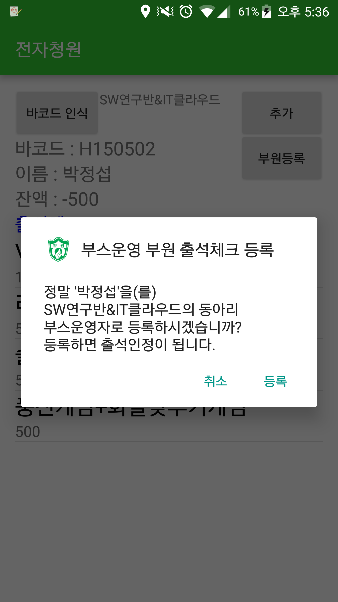

# CheongwonPay
For Cheongwon Festival, Payments and Attendance Application using Student ID Cards

# 전자청원
청원고·청원여고의 학교축제인 "청원어울마당"을 위한, 학생증을 이용한 결제지불과 출결처리 애플리케이션

## 소개

청원고·청원여고 연합학생회, 청원고 SW연구반, 청원여고 IT Cloud에서 운영을 담당하였다.

## 개발환경
- Android
- Java Server
- MySQL
- https://github.com/SudarAbisheck/ZXing-Orient

## 기능

### 로그인 화면
</img>

동아리이름과 패스워드를 통해 로그인. 최초 로그인시 패스워드 설정 후 진행

### 메인 기능
</img>
</img>
</img>

바코드인식 > 리스트에서 상품 선택하여 결제

### 상품 서비스 등록
</img>
</img>

- 축제 전 부스에서 제공하는 상품/활동 정보를 미리 등록
- 우측 상단 "추가"버튼을 눌러 팝업창에서 상품명과 가격을 등록(무료인 경우 0원으로 설정)
- 목록에서 길게눌러서 수정/삭제

### 부스운영 부원 출석체크 등록
</img>

- 학교에서 축제 부스를 운영하는 학생은 출석조건에서 제외되는 정책이 있어 바코드 인식 후 "부원등록"하여 출석처리

### 임시학생증 등록(학생회)
</img>

- 관리자 계정(학생회에서 이용)으로 로그인시 이용하는 기능
- 축제 당일 학생증 미지참 혹은 분실한 경우에 한해 축제에 한해 사용 가능한 임시학생증발급
- "바코드 인식"하여 팔찌형 임시학생증 인식후 학교, 학번입력하여 임시학생증 발급 처리후 제공

## 플로우차트

## 문서

- [계획서](docs/축제%20내%20전자화폐화%20계획서.pdf)
- [학생용 이용 안내문](docs/전자청원%20관련%20안내문.pdf)
- [소논문](docs/축제%20내%20전자시스템화와%20분석.pdf)
- [최종 발표자료](http://prezi.com/abeyq0abvuql/)

# 전자청원2.0
[청원고SW연구반](https://github.com/Cheongwon-SW-Club)에서 매년 유지,보수,개선하여 축제에 운영하고 있다.

[CheongwonPay2.0-Android](https://github.com/ms214/CheongwonPay2.0-Android)

[CheongwonPay2.0-Server](https://github.com/ms214/CheongwonPay2.0-Server)
